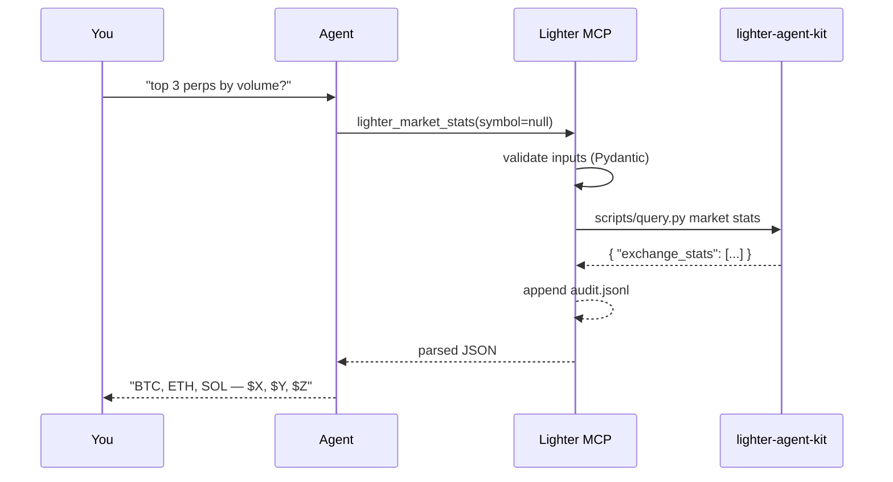

This walkthrough assumes you've finished [Installation](/get-started/installation)
and at least one [agent adapter](/adapters/overview) is connected.

## 1. Smoke-test the server

In your shell:

```bash
lighter-mcp doctor
```

You should see something like:

```json
{
  "ok": true,
  "mode": "readonly",
  "kit_path": "/Users/you/.lighter/lighter-agent-kit",
  "host": "https://mainnet.zklighter.elliot.ai",
  "audit_log": "/Users/you/.lighter/lighter-mcp/audit.jsonl",
  "config_source": "/Users/you/.lighter/lighter-mcp/config.toml",
  "system": { "code": 200, "status": "ok", ... }
}
```

If `ok: false`, jump to [Diagnostics](/tools/diagnostics) — the
`error.script` and `error.stderr` fields tell you what to fix.

## 2. Try a read

Ask your agent:

> What are the top three perp markets on Lighter by 24-hour volume?

The agent should call `lighter_market_stats`, sort by `volume_24h_usd`,
and reply. Behind the scenes:



## 3. Switch to paper mode

Edit `~/.lighter/lighter-mcp/config.toml` and flip the top-level `mode`
key (`kit_path` was already filled in by `lighter-mcp init`):

```toml
mode = "paper"
```

Restart the MCP transport (in Cursor: *Reload MCP servers*; in Claude
Desktop: quit & relaunch). Then ask:

> Open a paper account, then go long 0.01 BTC at market.

The agent should call `lighter_paper_init` followed by
`lighter_paper_market_order(symbol="BTC", side="long", amount=0.01)`.

<Tip>
If you skip the `_init` call, the kit will report
`paper account not initialized`. The agent should chain them — but ask
out loud if it doesn't.
</Tip>

## 4. Inspect the audit log

```bash
tail -n 5 ~/.lighter/lighter-mcp/audit.jsonl | jq
```

Every call (success or failure) is here, with sanitized argv and
result. See [Audit log](/reference/audit-log) for the full record
format and redaction rules.

## 5. (Optional) Going live

<Warning>
Read the [disclaimer](/security/disclaimer) and the
[threat model](/security/threat-model) before this step.
</Warning>

Promote your config to `mode = "live"` and add a `[live]` block with
narrow caps:

```toml
mode = "live"

[live]
enabled = true
allowed_symbols = ["BTC"]
max_order_notional_usd = 250
max_daily_notional_usd = 1000
max_leverage = 5
require_confirmation = true
```

Restart the server. Every live tool now goes through a preview/confirm
cycle. See [Modes & safety](/get-started/modes-and-safety) for the
full promotion checklist.

## What's next

<CardGroup cols={2}>
  <Card title="Configuration reference" icon="sliders" href="/get-started/configuration">
    Every key in the TOML, with types, defaults, and effects.
  </Card>
  <Card title="Tools overview" icon="book" href="/tools/overview">
    Browse every tool with input schemas and example responses.
  </Card>
  <Card title="Guarded live order walkthrough" icon="shield-check" href="/guides/guarded-live-order">
    The full preview → approve → execute flow on `lighter_live_market_order`.
  </Card>
  <Card title="Price alerts daemon" icon="bell" href="/guides/price-alerts">
    Run `lighter-mcp watch` to get notified on threshold crossings.
  </Card>
</CardGroup>
