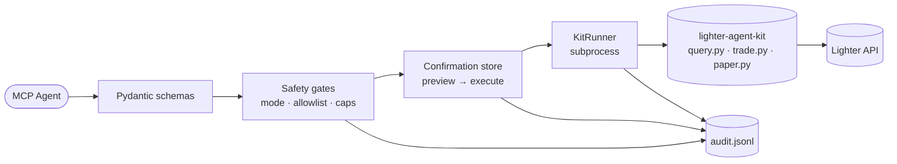

## The 30-second pitch

Lighter MCP is a **portable Model Context Protocol server** that exposes
[Lighter](https://lighter.xyz) trading to any MCP-capable agent — Cursor, Claude Code,
Claude Desktop, Codex, OpenClaw, and generic MCP clients — with **safety as a
first-class concern**, not an afterthought.

It wraps the official
[`lighter-agent-kit`](https://github.com/elliottech/lighter-agent-kit) Python
scripts via subprocess and adds:

<CardGroup cols={2}>
  <Card title="Typed input schemas" icon="square-check">
    Pydantic models with regex-validated symbols, asset codes, and bounded numeric ranges. No CLI argument injection is possible.
  </Card>
  <Card title="Mode gates" icon="lock-keyhole">
    Tool catalog grows monotonically: `readonly` → `paper` → `live` → `funds`. Higher-risk tools don't appear until you opt in.
  </Card>
  <Card title="Two-step confirmations" icon="signature">
    Every fund-loss path: first call returns a preview + single-use token; second call with the token executes. Tokens are bound to tool + argument digest + TTL.
  </Card>
  <Card title="Notional + leverage caps" icon="gauge">
    Per-order, daily (UTC-keyed, persistent), and per-symbol allowlists. Fail-closed: missing price feed blocks the order.
  </Card>
  <Card title="Append-only audit log" icon="scroll">
    Every call (success or failure) appended as JSONL with sanitized argv/result. Intra-process lock + POSIX `flock`. Soft-fails on disk error.
  </Card>
  <Card title="Streamable-HTTP transport" icon="network-wired">
    Refuses to bind on a non-loopback address unless `--allow-remote` is passed (the server has no built-in auth — front it yourself).
  </Card>
</CardGroup>

## Why not just use the kit directly?

The kit is a CLI for a human. This server is the safety harness for a
**non-human caller**.

Every call is schema-validated, gate-checked, audited, and (for write paths)
preview-confirmed **before** any subprocess runs against the exchange. The
agent literally cannot reach the kit without going through these layers.

## How it relates to other pieces

<AccordionGroup>
  <Accordion title="lighter-agent-kit" icon="toolbox">
    The official Python kit from elliottech that talks to the Lighter API,
    handles tx signing, and pins all SDK dependencies. Lighter MCP shells out
    to its `scripts/{query,trade,paper}.py` entrypoints — we never bypass them.

    Pin to a known-good kit commit if you fork.
  </Accordion>

  <Accordion title="Model Context Protocol (MCP)" icon="plug">
    An open standard for letting AI agents call external tools through a
    typed interface. Lighter MCP speaks MCP 1.2+ over **stdio** (default for
    local agents) or **streamable HTTP** (for daemon use behind a reverse
    proxy).
  </Accordion>

  <Accordion title="Adapters" icon="puzzle-piece">
    Each agent platform has slightly different conventions for how MCP servers
    are configured (and where slash commands / sub-agents live). The
    `adapters/` folder ships a pre-built UX layer per platform driven by the
    same MCP tools — see [Agent adapters](/adapters/overview).
  </Accordion>
</AccordionGroup>

## Where to next

<CardGroup cols={2}>
  <Card title="Install" icon="download" href="/get-started/installation">
    5-minute install on macOS / Linux. The script writes a `readonly` config you can promote later.
  </Card>
  <Card title="Quick start" icon="rocket" href="/get-started/quickstart">
    Connect Cursor / Claude / Codex and run your first read-only call.
  </Card>
  <Card title="Modes & safety" icon="shield-halved" href="/get-started/modes-and-safety">
    Understand the four modes and the gates between them before flipping `mode = "live"`.
  </Card>
  <Card title="Tools reference" icon="book" href="/tools/overview">
    Full catalog of every MCP tool, with schemas, response shapes, and per-tool error tables.
  </Card>
</CardGroup>
