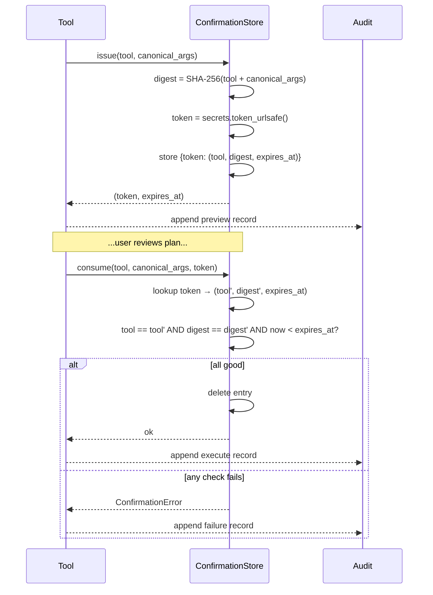

`lighter_mcp/confirmations.py` implements the **single-use, args-bound,
TTL-limited token** that gates every fund-loss path.

## Lifecycle



## What "canonical args" means

The store hashes the args **excluding** `confirmation_id` itself —
otherwise the second call (which adds the token) would always mismatch.
Other than that, args are serialized via `json.dumps(..., sort_keys=True)`
so dict ordering doesn't change the digest.

If the agent changes any argument between preview and execute (different
amount, different price, different `slippage`, etc.), the second call
produces a different digest and the token is rejected with:

```json
{ "ok": false, "category": "confirmation", "error": "confirmation token bound to different tool/args" }
```

This is the safety property that prevents an agent from showing the
user one plan and executing another.

## TTL

Default `120` seconds, configurable via `confirmation_ttl_s`. Short
enough that a stale token can't be reused after the user wandered away;
long enough that the agent has plenty of time to render the preview
and ask for approval.

If the TTL passes:

```json
{ "ok": false, "category": "confirmation", "error": "confirmation token expired" }
```

The agent must re-issue (call the tool without `confirmation_id` again
to get a fresh preview) and the user must re-approve.

## Single-use

`consume()` deletes the entry on success. A subsequent call with the
same token returns:

```json
{ "ok": false, "category": "confirmation", "error": "unknown confirmation token" }
```

The two-step flow is therefore **always** "one preview → one execute",
never "one preview → multiple executes".

## Why not put confirmations on the agent side?

Some agents do enforce a preview/approve UX themselves. For those, you
can set `live.require_confirmation = false` and the wrapper skips the
preview step. **Funds tools always confirm regardless** — irreversible
asset moves are too costly to delegate.

## Storage

Confirmations live in memory (`dict`) with an `asyncio.Lock` for
concurrent access. They are deliberately **not** persisted across
restarts — a server restart should never let a token survive its TTL.

## Why bind to a digest, not the raw args?

We never want to log the canonical args twice (once when issued, once
when consumed). The digest gives us the binding property we need
(args identity) without keeping copies of plan data in the store.
