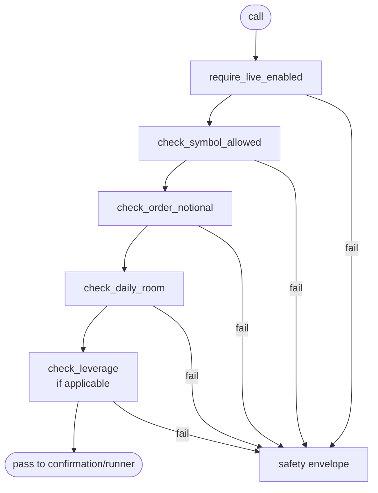

`lighter_mcp/safety.py` is the gate keeper. Every write tool calls into
it **before** assembling argv or hitting the kit. A failed gate raises
`SafetyError`, which the tools collapse into a `safety` envelope.

## What it gates

| Method                              | Reads from config              | When it's called                      |
| ----------------------------------- | ------------------------------ | ------------------------------------- |
| `require_live_enabled()`            | `live.enabled`                 | Every `lighter_live_*` and `lighter_funds_*` tool. |
| `require_withdrawals_enabled()`     | `funds.withdrawals_enabled`    | `lighter_funds_withdraw`.             |
| `require_transfers_enabled()`       | `funds.transfers_enabled`      | `lighter_funds_transfer`.             |
| `check_symbol_allowed(symbol)`      | `live.allowed_symbols`         | Order tools (limit / market / modify / cancel / leverage / margin). |
| `check_order_notional(usd)`         | `live.max_order_notional_usd`  | Limit / market / modify.              |
| `check_daily_room(usd)`             | `live.max_daily_notional_usd`  | Limit / market / modify, **before** execution. |
| `record_executed_notional(usd)`     | (writes to ledger)             | After the kit confirms a fill.        |
| `check_leverage(leverage)`          | `live.max_leverage`            | `lighter_live_set_leverage`.          |
| `check_withdrawal_amount_usd(usd)`  | `funds.max_withdrawal_usd`     | `lighter_funds_withdraw`.             |
| `snapshot()`                        | (read-only)                    | `lighter_safety_status`.              |

## The daily-notional ledger

The hardest gate to get right. Implementation notes:

<CardGroup cols={2}>
  <Card title="UTC-keyed" icon="globe">
    Counter is stored under the current UTC date string. At UTC midnight, the next call sees a new key and starts at 0.
  </Card>
  <Card title="Persistent" icon="database">
    State lives in `~/.lighter/lighter-mcp/daily-notional.json` next to the audit log. Restarting the server does not reset it.
  </Card>
  <Card title="Atomic writes" icon="floppy-disk">
    Updates use `os.replace` after writing to a temp file in the same directory. Crash-safe: you'll either see the old or new version, never a partial.
  </Card>
  <Card title="Fail-closed on corruption" icon="lock">
    If the file is unreadable or has the wrong shape, the ledger refuses to grant any room — every call returns `cap exhausted`. It will **never** silently reset to 0.
  </Card>
</CardGroup>

```json title="daily-notional.json (example)"
{
  "version": 1,
  "date": "2026-04-26",
  "executed_today_usd": 217.40,
  "last_updated": 1782799000.0
}
```

## Notional estimation for market orders

Market orders don't have a price input, so the cap check needs an
estimate. The flow is:

1. Call `query.py market stats --symbol <X>`.
2. From the first non-zero of `last_trade_price`, `mark_price`,
   `index_price`, `price`, compute `amount × price`.
3. If none are usable, **fail closed** — the order is rejected with
   `Cannot estimate notional for market order: price feed unavailable.`

This is deliberately conservative. Letting a market order through when
no price feed is available would mean no cap was checked.

## Ordering of checks

Order matters: cheaper / less surprising checks come first.



A failed gate **never** spawns a subprocess, **always** writes an audit
record, and **never** advances the daily counter.

## Why `record_executed_notional` runs after the kit

The day's room is checked **before** the call. The counter advances
**after** a successful fill (when the kit returns a non-error result).
This means:

- A failed kit call (e.g. exchange rejected for insufficient balance)
  does **not** consume daily room.
- A successful fill consumes daily room exactly once.
- If the wrapper crashes between "kit succeeded" and "ledger updated",
  the order is honored on the exchange but the day's counter is
  slightly low. We accept that asymmetry — the alternative
  (advance-then-rollback) risks double-counting.

## Inspection

```bash
# Snapshot from the MCP itself
lighter-mcp doctor | jq '.safety // empty'

# Or via the always-on tool
echo '{"name":"lighter_safety_status","arguments":{}}' \
  | lighter-mcp stdio …  # in practice, your agent calls it for you
```

The `safety` block in those snapshots includes `daily_notional` with
`executed_today_usd` and `remaining_usd` so the agent can plan
multi-step strategies inside its remaining budget.

## Why fail-closed everywhere

- Schema check fails → don't run the kit.
- Allowlist fails → don't run the kit.
- Notional estimate unavailable → don't place the order.
- Daily ledger file corrupt → refuse all writes.
- Confirmation token wrong → don't execute.

The single principle: **a missing or ambiguous input is treated as a
denial**. We'd rather block a legitimate trade and force the user to
investigate than let an unsafe one through.
