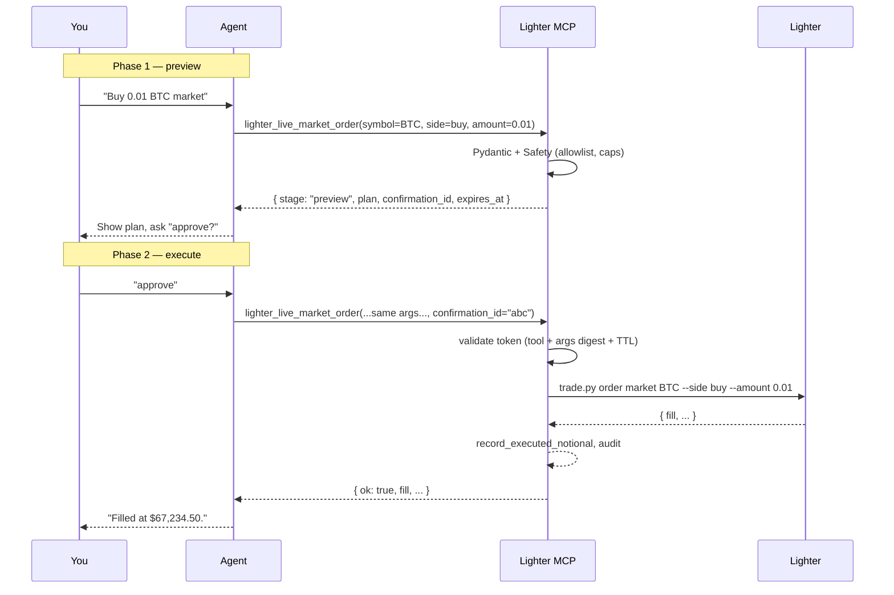

<Warning>
Live tools place real, irreversible orders against the Lighter exchange.
Read the [disclaimer](/security/disclaimer), set narrow caps in `[live]`,
and prefer paper trading until you trust the agent's behavior on your
account.
</Warning>

Live tools wrap `scripts/trade.py` from the kit. They are registered
**only** when:

- `mode = "live"` (or `"funds"`) in the config, and
- `[live]` block has `enabled = true`.

Otherwise they don't appear in the MCP catalog at all.

## At a glance

| Tool                            | Confirms? | Notes                                                         |
| ------------------------------- | :-------: | ------------------------------------------------------------- |
| `lighter_live_limit_order`      | ✅        | Place a limit order. Bound by per-order + daily notional.     |
| `lighter_live_market_order`     | ✅        | Slippage-bound market order. Fail-closed if no price feed.    |
| `lighter_live_modify_order`     | ✅        | Modify an open order's price/amount.                          |
| `lighter_live_cancel_order`     | —         | Single-order cancel. Low-risk; no confirmation.               |
| `lighter_live_cancel_all`       | ✅        | Cancel every open order across markets.                       |
| `lighter_live_close_all`        | ✅        | Flatten every position via reduce-only market orders.         |
| `lighter_live_set_leverage`     | ✅        | Per-symbol leverage. Bounded by `live.max_leverage`.          |
| `lighter_live_adjust_margin`    | ✅        | Add/remove isolated margin for one position.                  |

Confirming tools accept `confirmation_id`. The first call returns a
`stage: "preview"` envelope; the second call (same args + the token)
executes. Set `live.require_confirmation = false` only if your agent
already enforces a preview/approve UX upstream.

---

## Two-step confirmation flow



---

## `lighter_live_limit_order`

<ParamField path="symbol" type="string" required />
<ParamField path="side" type="'buy' | 'sell' | 'long' | 'short'" required />
<ParamField path="amount" type="float" required>Base-asset amount, > 0.</ParamField>
<ParamField path="price" type="float" required>Limit price, > 0.</ParamField>
<ParamField path="reduce_only" type="boolean" default="false" />
<ParamField path="post_only" type="boolean" default="false" />
<ParamField path="confirmation_id" type="string | null" default="null">
  Omit on the first call (preview). Include on the second call to execute.
</ParamField>

**Pre-execution gates**

1. `safety.require_live_enabled()` — `[live].enabled` must be `true`.
2. `safety.check_symbol_allowed(symbol)` — `[live].allowed_symbols`.
3. `safety.check_order_notional(amount × price)` —
   `[live].max_order_notional_usd`.
4. `safety.check_daily_room(amount × price)` —
   `[live].max_daily_notional_usd` minus today's executed total.
5. Two-step confirmation if `[live].require_confirmation = true`.

```json title="Preview envelope"
{
  "ok": true,
  "stage": "preview",
  "tool": "lighter_live_limit_order",
  "plan": {
    "action": "place_limit_order",
    "symbol": "BTC",
    "side": "buy",
    "amount": 0.01,
    "price": 67000.0,
    "estimated_notional_usd": 670.0,
    "reduce_only": false,
    "post_only": false
  },
  "confirmation_id": "5b9b...e1c2",
  "expires_at": 1782800400.0,
  "next": "Show this plan to the user. To execute, call the same tool with the same arguments and confirmation_id set to the value above."
}
```

After successful execution, `record_executed_notional` is called so the
daily counter advances.

---

## `lighter_live_market_order`

<ParamField path="symbol" type="string" required />
<ParamField path="side" type="'buy' | 'sell' | 'long' | 'short'" required />
<ParamField path="amount" type="float" required>Base-asset amount, > 0.</ParamField>
<ParamField path="slippage" type="float | null" default="null">
  Slippage budget as a fraction. Range `0.0`–`0.5`. Default `0.01` (1 %)
  is applied by the kit when `null`.
</ParamField>
<ParamField path="confirmation_id" type="string | null" default="null" />

<Warning>
Market orders need a notional estimate before any cap can be checked.
The server fetches `market_stats` for the symbol and uses the first
non-zero of `last_trade_price` / `mark_price` / `index_price` / `price`.
**If no usable price is returned, the order is rejected** with
`Cannot estimate notional for market order: price feed unavailable`.
This is a deliberate fail-closed.
</Warning>

---

## `lighter_live_modify_order`

<ParamField path="symbol" type="string" required />
<ParamField path="order_index" type="integer" required>
  The `client_order_index` from `lighter_orders_open`.
</ParamField>
<ParamField path="price" type="float" required>New limit price, > 0.</ParamField>
<ParamField path="amount" type="float" required>New base amount, > 0.</ParamField>
<ParamField path="confirmation_id" type="string | null" default="null" />

<Note>
The new notional is treated as fully fresh exposure for both per-order
and daily caps. This may double-count vs the original order — that's
the conservative (fail-closed) default. The day's rolling cap therefore
correctly limits how much extra exposure a modify can add.
</Note>

---

## `lighter_live_cancel_order`

<ParamField path="symbol" type="string" required />
<ParamField path="order_index" type="integer" required />

Single-order cancel. Low-risk; **no confirmation required**. Still gated
by `live.enabled` and the symbol allowlist.

---

## `lighter_live_cancel_all`

Cancel every open order across all markets.

<ParamField path="confirmation_id" type="string | null" default="null" />

```json title="Preview plan"
{
  "action": "cancel_all_orders",
  "scope": "all markets",
  "warning": "TP/SL bracket orders will also be cancelled."
}
```

---

## `lighter_live_close_all`

Flatten every open position via reduce-only market orders.

<ParamField path="slippage" type="float | null" default="null" />
<ParamField path="with_cancel_all" type="boolean" default="false">
  Cancel all open orders before closing positions.
</ParamField>
<ParamField path="confirmation_id" type="string | null" default="null" />

The plan body **always includes the kit's own `--preview` output**, so
the agent can show the user exactly which positions will close and at
what estimated price before approving.

```json title="Preview plan (excerpt)"
{
  "action": "close_all_positions",
  "with_cancel_all": false,
  "slippage": 0.01,
  "kit_preview": {
    "positions_to_close": [
      { "symbol": "BTC", "side": "long", "size": "0.05", "estimated_close_price": "67100.00" }
    ],
    "estimated_total_notional_usd": "3355.00"
  }
}
```

---

## `lighter_live_set_leverage`

<ParamField path="symbol" type="string" required />
<ParamField path="leverage" type="integer" required>1–100. Further bounded by `[live].max_leverage`.</ParamField>
<ParamField path="margin_mode" type="'cross' | 'isolated' | null" default="null">
  When `null`, the existing margin mode is preserved.
</ParamField>
<ParamField path="confirmation_id" type="string | null" default="null" />

---

## `lighter_live_adjust_margin`

Add or remove **isolated** margin collateral on one perp position.

<ParamField path="symbol" type="string" required />
<ParamField path="amount" type="float" required>USD amount of collateral, > 0.</ParamField>
<ParamField path="direction" type="'add' | 'remove'" required />
<ParamField path="confirmation_id" type="string | null" default="null" />

Cross-margin positions don't accept this — the kit rejects with
`adjust_margin only supported for isolated positions`.

---

## Common errors

<AccordionGroup>
  <Accordion title="Safety envelope" icon="shield-halved">
    Returned when a gate blocks the call.

    ```json
    { "ok": false, "category": "safety", "error": "<reason>" }
    ```

    | `error` text                                                                                | Fix                                                                              |
    | ------------------------------------------------------------------------------------------- | -------------------------------------------------------------------------------- |
    | `live mode is not enabled in this server's config`                                          | Set `[live].enabled = true` and restart, or stop trying to write in readonly.    |
    | `symbol XYZ not in live.allowed_symbols`                                                    | Add the symbol to the allowlist (after considering risk), or pick another.       |
    | `order notional 1234.56 exceeds live.max_order_notional_usd=500.00`                         | Lower `amount` or raise the cap.                                                 |
    | `daily notional 950.00 + new 250.00 exceeds live.max_daily_notional_usd=1000.00`            | Wait until UTC midnight or raise the cap.                                        |
    | `leverage 25 exceeds live.max_leverage=10`                                                  | Lower the request or raise the cap.                                              |
    | `Cannot estimate notional for market order: price feed unavailable.`                        | Use a limit order, or wait for `market_stats` to come back.                      |
  </Accordion>

  <Accordion title="Confirmation envelope" icon="key">
    Returned when the token is missing, mismatched, or expired.

    ```json
    { "ok": false, "category": "confirmation", "error": "<reason>" }
    ```

    | `error` text                                              | Fix                                                                          |
    | --------------------------------------------------------- | ---------------------------------------------------------------------------- |
    | `unknown confirmation token`                              | Re-issue a preview; copy the new `confirmation_id` exactly.                  |
    | `confirmation token expired`                              | TTL passed (default 120s). Re-issue.                                         |
    | `confirmation token bound to different tool/args`         | Args changed between preview and execute. Re-issue with the final args.      |
  </Accordion>

  <Accordion title="Runner errors" icon="circle-exclamation">
    Returned when the kit subprocess fails. See [Error envelope](/reference/error-envelope) for the full shape.

    | Symptom                                              | Likely cause                                | Fix                                                                  |
    | ---------------------------------------------------- | ------------------------------------------- | -------------------------------------------------------------------- |
    | `kit script trade.py exited with code 2`             | Bad symbol or invalid kit args.             | Check `stderr` (last 2 KiB included) and re-issue with corrected args. |
    | `kit script trade.py timed out after 60s`            | Network blocked or signing wedged.          | `lighter-mcp doctor`; consider testnet for development.              |
    | `kit script trade.py returned non-JSON output`       | Vendoring noise or kit panic.               | Re-install the kit; check its venv is clean.                         |
    | `{"error": "insufficient balance ..."}`              | Account doesn't have enough collateral.     | Deposit, or trade smaller.                                            |
  </Accordion>
</AccordionGroup>

## Defensive patterns

<CardGroup cols={2}>
  <Card title="Always read before write" icon="eye">
    Call `lighter_account_info` before every order so the agent can verify
    available margin and current positions, instead of trusting cached state.
  </Card>
  <Card title="Use `lighter_safety_status`" icon="gauge">
    Cheap and side-effect-free. Tells the agent how much daily room is
    left and which symbols are allowed, **before** it composes a write.
  </Card>
  <Card title="Prefer limit orders" icon="arrow-down-up">
    The notional check on limit orders is exact (`amount × price`),
    not an estimate. Market orders fail-closed when no price feed is
    available.
  </Card>
  <Card title="Pin the symbol allowlist" icon="filter">
    The empty-list "no allowlist" mode is supported but strongly
    discouraged for production agents.
  </Card>
</CardGroup>
