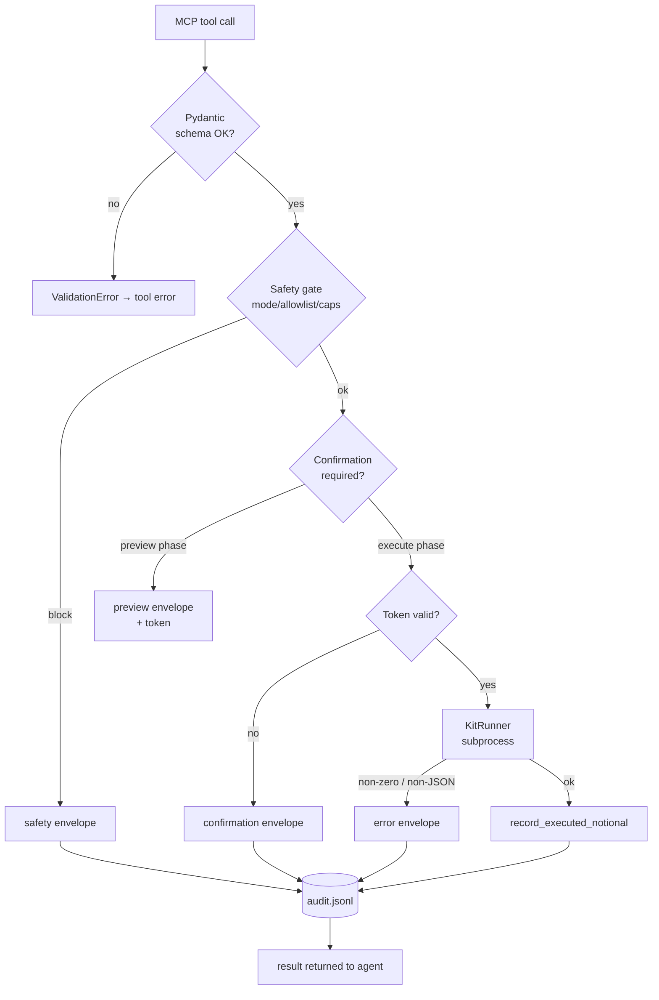

Every tool is a thin Pydantic-validated adapter over the kit's
`scripts/{query,paper,trade}.py` CLI. Inputs are normalized, argv is
assembled, and the runner returns parsed JSON. Failures collapse into
a [uniform error envelope](/reference/error-envelope).

## Families

<CardGroup cols={2}>
  <Card title="Read-only" icon="chart-line" href="/tools/read">
    15 tools. Market stats, books, candles, funding, account info, orders.
    No credentials required for public reads.
  </Card>
  <Card title="Paper trading" icon="flask" href="/tools/paper">
    11 tools. Local simulator against live snapshots. No risk gates beyond input validation.
  </Card>
  <Card title="Live trading" icon="bolt" href="/tools/live">
    8 tools. Limit / market / modify / cancel / cancel-all / close-all / leverage / margin.
    Gated by mode + allowlist + caps + two-step confirmation.
  </Card>
  <Card title="Funds & withdrawals" icon="vault" href="/tools/funds">
    2 tools. Transfer between perp/spot routes; off-Lighter withdrawal.
    Always two-step confirmed.
  </Card>
  <Card title="Diagnostics" icon="stethoscope" href="/tools/diagnostics">
    `lighter_health`, `lighter_version`, `lighter_safety_status`. Always available regardless of mode.
  </Card>
</CardGroup>

## Cross-cutting input rules

All inputs go through Pydantic before any subprocess is spawned.
Bad inputs never reach the kit.

| Field           | Constraint                                                                                                 |
| --------------- | ---------------------------------------------------------------------------------------------------------- |
| `symbol`        | Uppercased, must match `^[A-Z0-9][A-Z0-9._/-]{0,31}$`. Examples: `BTC`, `ETH`, `SOL`, `ETH/USDC`.          |
| `asset`         | `^[A-Z0-9][A-Z0-9._-]{0,15}$`. Used for funds tools.                                                       |
| `market_type`   | `"perp"` or `"spot"`.                                                                                      |
| `side`          | `"buy" \| "sell" \| "long" \| "short"`.                                                                    |
| `resolution`    | One of `1m`, `5m`, `15m`, `30m`, `1h`, `4h`, `1d`.                                                         |
| `margin_mode`   | `"cross"` or `"isolated"`.                                                                                  |
| `leverage`      | Integer, `1`–`100`. Further bounded by `live.max_leverage`.                                                |
| `slippage`      | Float, `0.0`–`0.5` (i.e. up to 50 %). Default `0.01`.                                                       |
| `confirmation_id` | Opaque token from a preview call. Tool + canonical-args bound, TTL-limited.                              |

The symbol and asset regexes deliberately reject shell metacharacters
and CLI flag prefixes (e.g. `--side=long`) so a hostile prompt cannot
inject argv.

## How a write call flows through the layers

## Diagnostics tools (always on)

| Tool                      | Purpose                                                                  |
| ------------------------- | ------------------------------------------------------------------------ |
| `lighter_health`          | Combined check: kit reachable, system status, credentials present.       |
| `lighter_version`         | Server version + active config summary + safety snapshot.                |
| `lighter_safety_status`   | Active mode, allowlists, remaining daily notional budget.                |

Use these whenever the agent gets confused — `lighter_safety_status` in
particular tells you exactly what the gate model thinks the world looks
like right now.

## See also

- [Error envelope](/reference/error-envelope) — the shape every failure collapses into.
- [Safety internals](/reference/safety) — how the caps and allowlists work.
- [Confirmations internals](/reference/confirmations) — token lifecycle.
- [Audit log](/reference/audit-log) — record format and redaction.
